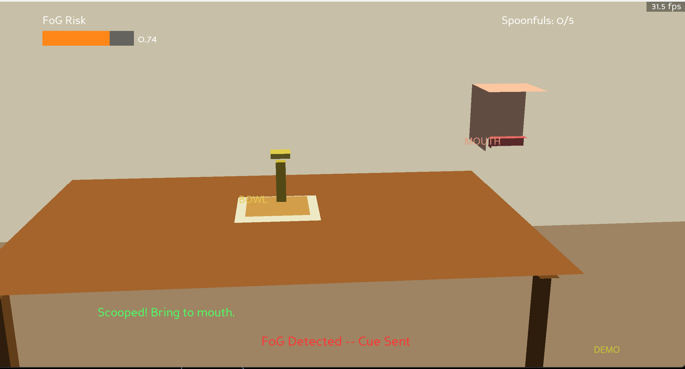
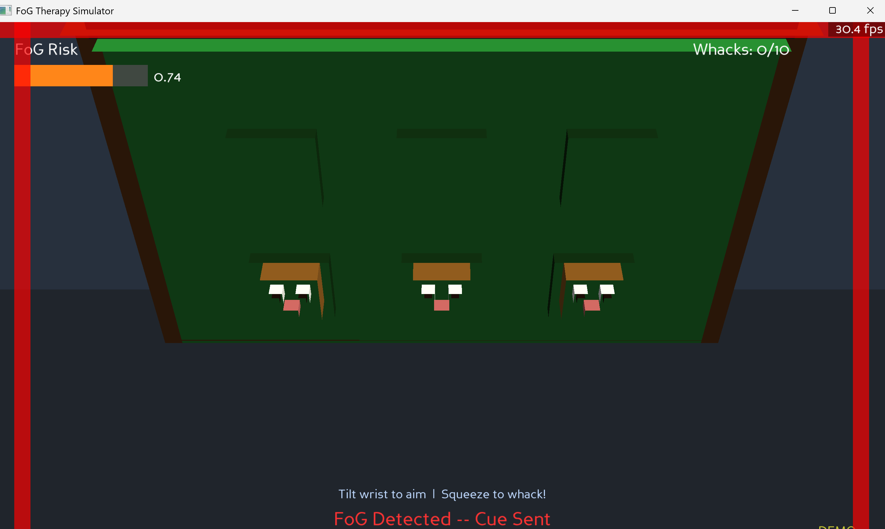

# FoG Therapy Simulator

A real-time Parkinson's therapy application that uses a wrist-worn sensor (watch/wristband) to detect Freezing of Gait (FoG) and deliver haptic feedback cues — while the patient plays interactive games to practise fine motor control.

## What it does

Patients wear a small wrist sensor containing an IMU (accelerometer + gyroscope) and an FSR pressure pad. The sensor connects over USB serial to a PC running this simulator.

The simulator runs in two layers simultaneously:

1. **FoG detection** — a trained ML model watches the IMU signal in real time. When a FoG episode is detected, it sends a haptic pressure pulse (vibration) through the wrist sensor as a rhythmic cue to help re-initiate movement. The game itself continues uninterrupted.

2. **Therapy game** — the patient uses wrist tilt and squeeze to play one of two games, exercising motor control and maintaining engagement during therapy.

## Games

### [E] Eating



Kitchen table scene. Tilt your wrist to guide a spoon from a bowl to a mouth target. Complete 5 successful scoop-and-feed cycles.

- `acc_x` (lateral tilt) → spoon left/right
- `acc_y` (vertical swing) → spoon up/down
- FSR pressure drop → grip lost

### [M] Whack-a-Mole



Arcade board scene. Tilt your wrist to aim a mallet cursor over the 3×3 grid, then squeeze the watch FSR sensor to whack moles as they pop up. Hit 10 moles to complete.

- `acc_x` (lateral tilt) → cursor left/right
- `acc_y` (vertical swing) → cursor up/down
- FSR pressure rising edge → whack

## FoG response

When FoG is detected the **game continues normally** — no visual changes, no pausing, no overlays. The only response is a haptic triple-pulse sent through the watch motor.

This is intentional. Interrupting gameplay (freezing the screen, showing warnings) would:
- break the patient's attentional focus on the motor task
- add anxiety rather than helping re-initiation
- conflate the therapy stimulus with a punishment signal

The haptic triple-pulse mimics an external rhythmic auditory cue (evidence-based for gait re-initiation in PD) delivered silently through the wrist. The patient feels it and can self-correct without losing game context.

A 2-second cooldown between pulses prevents over-cueing. The FoG risk bar and status text in the HUD are visible to a supervising clinician but positioned out of the patient's primary focus area.

## Hardware

| Component | Role |
|-----------|------|
| MPU-6050 IMU (SDA/SCL) | Accelerometer + gyroscope at 60 Hz |
| FSR on A0 | Squeeze / grip pressure |
| ERM/LRA motor on D9 (PWM) | Haptic cue output |
| Arduino Uno/Nano | USB serial bridge at 115200 baud |

See [arduino/firmware_reference.ino](arduino/firmware_reference.ino) for the Arduino sketch.

## Running

```bash
cd parkinsons
python virtual_sim/main.py
```

**Demo mode** (no hardware required) — uses synthetic sensor data with automatic FoG episodes every 20 seconds.

**Live mode** — connects to real Arduino. You will be prompted for the serial port (default `COM3`).

CLI flags:
```
--task  eating | whackamole   skip the menu
--mode  demo   | live         skip the menu
--port  COM3 | /dev/ttyACM0   serial port
--threshold  0.52             FoG detection threshold
```

Example:
```bash
python virtual_sim/main.py --task whackamole --mode demo
```

Press **ESC** to quit.

## Dependencies

```
panda3d>=1.10.14
pyserial>=3.5
numpy>=1.24.0
scipy>=1.10.0
scikit-learn>=1.3.0
joblib>=1.3.0
```

Install:
```bash
pip install -r virtual_sim/requirements.txt
```

## Project structure

```
virtual_sim/
├── main.py               Entry point and CLI menu
├── config.py             All tunable constants
├── tasks/
│   ├── base_task.py      Abstract task interface
│   ├── eating.py         Spoon / eating game
│   └── whackamole.py     Whack-a-mole game
├── sim/
│   ├── app.py            Panda3D main loop
│   ├── avatar.py         Avatar state machine (unused in fixed-camera tasks)
│   └── hud.py            FoG risk bar + progress overlay
├── fog/
│   ├── detector.py       Real-time FoG inference pipeline
│   └── buffer.py         Thread-safe ring buffer
├── haptic/
│   └── feedback.py       Haptic pulse patterns + cooldown
└── arduino/
    ├── comm.py            USB serial reader
    ├── mock.py            Synthetic data generator
    └── firmware_reference.ino  Arduino sketch
```
